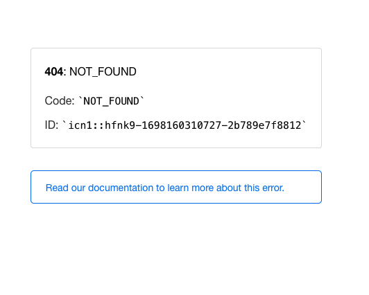

# Classting Quiz 웹앱 만들기 과제

## 프론트엔드 지원자 김민지입니다.

#### 목차
1. [결과물](#1-결과물)
2. [projects 정보](#2-projects-정보)
3. [프로젝트 개요](#3-프로젝트-개요)
4. [로컬 실행 방법](#4-로컬-실행-방법)
5. [프로젝트 구조](#5-프로젝트-구조)
6. [프로젝트 기능](#6-프로젝트-기능)
7. [기술 스택](#7-기술-스택)
8. [테스트 정보](#8-테스트-정보)
9. [배포](#9-배포)

---
## 1. 결과물
- [데모 사이트](https://classting-quiz.vercel.app/)
- [github 주소](https://github.com/minjispace/classting-quiz) 
- [github projects](https://github.com/users/minjispace/projects/5/views/1)

---

## 2. projects 정보
#### 1. 데모

<br/>

#### 2. vite 사용 이유
이 프로젝트는 Create React App (CRA) 대신 Vite를 사용하여 구성되었습니다. 

- **빠른 개발 서버**
    Vite는 빠른 개발 서버를 제공하여 코드 변경을 실시간으로 반영하고 빠른 화면 새로 고침을 가능하게 합니다. 
    이로 인해 빠른 반복을 통해 더 효율적으로 개발할 수 있습니다.

- **빠른 빌드**
    Vite는 빠른 빌드를 통해 프로덕션 환경에서의 성능을 최적화합니다. 
    불필요한 번들링이 없으므로 빌드 시간이 크게 단축됩니다.

- **모듈 번들링**
    Vite는 기본적으로 ES 모듈을 사용하고 브라우저에서 동적으로 로딩합니다. 
    이것은 프로젝트의 성능과 로딩 속도를 향상시킵니다.
<br/>

#### 3. github projects 사용 이유
**1. 프로젝트 관리의 투명성**
        - 프로젝트의 현재 상태와 진행 상황을 시각적으로 파악할 수 있습니다. 

**2. 작업 할당과 추적**
    - GitHub Projects를 사용하면 각 작업을 카드로 만들고, 작업의 책임과 진행 상황을 쉽게 추적할 수 있습니다.

**3. 우선순위 관리**
    -  카드를 컬럼에 나열하여 작업의 우선순위를 관리할 수 있습니다. 
    이를 통해 어떤 작업을 먼저 진행해야 하는지 이해할 수 있습니다.

**4. 스케줄 관리**
    - 프로젝트 일정을 보다 효율적으로 관리할 수 있습니다. 
<br/>

#### 4. 앱 사용방법
**1. 퀴즈 설정**

    애플리케이션을 실행한 후, 초기 설정 페이지가 표시됩니다.
    다음과 같은 설정을 조정할 수 있습니다

    - 문제 수: 풀고자 하는 문제의 수를 선택합니다.
    - 카테고리: 퀴즈 카테고리를 선택합니다.
    - 난이도: 퀴즈 난이도를 선택합니다.

**2. 퀴즈 풀이**

    설정을 마친 후 "퀴즈 풀기 시작" 버튼을 클릭합니다.
    퀴즈가 시작되며, 각 문제에 대한 4지선다가 표시됩니다.
    올바른 답을 선택하고 "정답 확인" 버튼을 클릭합니다.
    정답 여부에 따라 정답 수와 오답 수가 업데이트됩니다.
    모든 문제를 푼 후 결과 페이지로 이동합니다.

**3. 결과 페이지**

    결과 페이지에서는 다음 정보를 확인할 수 있습니다:
    만점(모든 문제를 맞힘)인 경우, 축하 메시지와 함께 콘페티 효과를 줍니다.
    
    - 소요 시간: 퀴즈 풀이에 소요된 시간
    - 정답 개수: 맞힌 문제 수
    - 오답 수: 틀린 문제 수
    - 정답 비율: 정답 비율 (백분율)


**4. 오답 노트**

    결과 페이지에서 "오답 노트 보기" 버튼을 클릭 => 오답노트 페이지로 이동 가능합니다.
    오답 노트 페이지에서는 각 오답 문제에 대한 카테고리, 정답, 문제를 확인하고 메모를 추가하거나 수정할 수 있습니다.
---

## 3. 프로젝트 개요 
"클래스팅 퀴즈" 웹앱 프로젝트는 온라인 퀴즈 게임을 제공하는 웹 응용 프로그램을 개발하는 것을 목표로 합니다. 

---

## 4. 로컬 실행 방법
1. git clone
    ```
    git clone https://github.com/minjispace/classting-quiz
    ```
3. node_modules 다운로드
    ```
    npm i 
      or
    yarn 
    ```
4. dev 실행 하기
    ```
    npm run dev
        or
    yarn dev
    ```
4. build 하기
    ```
    npm run build
        or
    yarn build
    ```
4. test 하기
    ```
    npm run test
        or
    yarn test
    ```
---


## 5. 프로젝트 구조 
프로젝트는 다음과 같은 구조로 구성되어 있습니다

1.  `public`
    - 웹 애플리케이션에서 사용되는 공개 이미지 및 리소스가 저장된 디렉토리입니다. 
    - 여기에는 웹 앱에서 사용하는 사진들이 포함됩니다.

2.  `src`
    - 소스 코드가 저장된 주요 디렉토리입니다. 
    - 이 디렉토리에는 다음과 같은 하위 디렉토리와 파일이 포함되어 있습니다

3.  `api`
    - API 호출 및 데이터 가져오기와 관련된 코드가 있는 디렉토리입니다. 
    API 통신 로직은 여기에 있습니다.

4.  `components` 
    - 리액트 컴포넌트들이 저장되는 디렉토리입니다. 
    - 재사용 가능한 UI 요소 및 컴포넌트가 여기에 있습니다.
        - `AnswerModal`: 정답 확인을 위한 모달 컴포넌트
        - `Loading`: 로딩 상태를 표시하는 컴포넌트
        - `NavBar`: 네비게이션 바 컴포넌트
        - `QuizMemo`: 퀴즈 결과 페이지의 개별 피드백 메모 컴포넌트
        - `RedirectHome`: 홈 페이지로 리디렉션하는 컴포넌트
        - `ResultChart`: 퀴즈 결과 차트를 표시하는 컴포넌트
        - `Timer`: 퀴즈 타이머 컴포넌트

5.  `context`
    - React Context API를 사용하여 상태 관리와 전역 상태를 처리하는 코드가 있는 디렉토리입니다.

6. `hooks`
    - 커스텀 React 훅이 정의되어 있는 디렉토리입니다. 
    

7. `mocks`
    - 개발 및 테스트 시에 사용되는 목 객체와 데이터가 포함된 디렉토리입니다.

8. `pages`
    - 라우팅을 처리하는 페이지 컴포넌트가 있는 디렉토리입니다. 
    - 각 파일은 특정 경로와 일치하며 해당 페이지를 나타냅니다.
        - `FeedbackNote`: 오답노트 전체 페이지
        - `Quiz`: 퀴즈 풀이 페이지
        - `Result`: 퀴즈 결과 페이지
        - `SetupForm`: 퀴즈 설정 폼 페이지
        - `SingleFeedback`: 개별 오답노트 페이지

9. `test-utils`
    - 테스트 시 사용하는 유틸리티 함수와 설정 파일이 있는 디렉토리입니다.

10. `types`
    - TypeScript 타입 정의가 있는 디렉토리입니다. 
    - 이 디렉토리에는 `QuizType`이 있습니다.

11. `utils`
    - 유틸리티 함수와 도우미 함수가 정의된 디렉토리입니다. 
    - 이 디렉토리에는 다음과 같은 파일이 있습니다:
        - `formatTime`: 시간 형식을 포맷하는 함수
        - `dataOption`: 데이터 옵션 관련 도우미 함수
        - `localStorage.quizResult`: 퀴즈 결과를 저장하는 로컬 스토리지 함수
        - `localStorage.singleMemo`: 개별 메모를 저장하는 로컬 스토리지 함수
        - `uniqueId`: 고유한 ID를 생성하는 도우미 함수

또한 프로젝트 루트에는 프로젝트 설정 파일과 의존성 패키지 정보가 있는 `package.json` 파일이 있습니다.

---

## 6. 프로젝트 기능 
##### **1. 퀴즈 설정**
- 문제 수, 카테고리, 난이도를 선택하여 원하는 조건의 퀴즈를 설정합니다.
- 사용자가 원하는 퀴즈 조건을 선택하면 퀴즈 데이터를 가져옵니다.

##### **2. 퀴즈 풀이**
- 설정한 조건에 따라 퀴즈를 풉니다.
- 각 문제는 4지선다로 제공되며, 정답을 선택합니다.
- 정답 여부에 따라 정답 수와 오답 수가 기록됩니다.

##### **3. 결과 페이지**
- 퀴즈 풀이가 끝나면 결과 페이지로 이동합니다.
- 퀴즈 소요 시간, 정답 수, 오답 수, 정답 비율 등의 정보를 확인할 수 있습니다.
- 만점일 경우 축하 메시지와 함께 콘페티 효과가 표시됩니다.
- 오답이 있을경우, 오답노트 페이지로 이동가능합니다.

##### **4. 오답 노트**
- 틀린 문제에 대한 메모를 작성할 수 있습니다.
- 각 오답 문제에 대한 카테고리, 정답, 문제를 확인하고 메모를 추가합니다.
- 오답 노트에서 메모를 수정하고 저장할 수 있습니다.

---

## 7. 기술 스택 
- **Frontend**
  - 언어: JavaScript (ES modules)
  - 웹 개발 도구: Vite
  - 뷰 라이브러리: React.js
  - 스타일링: Tailwind CSS
  - 차트 및 그래프: Chart.js, react-chartjs-2
  - 애니메이션: react-confetti
  - 라우팅: react-router-dom
  - 상태 관리: react-query
  - HTTP 요청: Axios
  - 테스트 라이브러리: Jest, @testing-library
  - Mock 서버: MSW (Mock Service Worker)

- **빌드 및 번들링**
  - TypeScript
  - Vite

---

## 8. 테스트 정보
#### 1. Jest를 선택한 이유
**1. Jest는 인기있는 테스트 프레임워크**
    - Jest는 JavaScript 프로젝트에서 널리 사용되며 커뮤니티 지원이 풍부합니다. 
    - 이로 인해 문제 해결, 업데이트 및 지속적인 지원이 보장됩니다.

**2. Snapshot 테스팅 지원**
    - Jest는 스냅샷 테스팅을 지원하여 컴포넌트의 렌더링 결과물을 쉽게 비교하고 추적할 수 있습니다.

**3. 비동기 코드 테스팅**
    - Jest는 비동기 코드를 다루기 쉽게 설계되었으며, async/await 및 Promise와 같은 비동기 패턴을 지원합니다.

**4. Mocking 기능**
    - Jest는 모의(mocking) 기능을 내장하고 있어, 외부 의존성을 테스트할 때 매우 유용합니다.

<br/>

#### 2. 테스트 목적 이유

**1. Quiz 컴포넌트 테스트**
👉🏻 데이터가 없을 때 Redirect Home Component로 테스트: 
    이 테스트는 퀴즈 데이터가 서버에서 정상적으로 가져와지지 않을 때 어떻게 동작해야 하는지 확인합니다. 사용자에게 적절한 에러 메시지가 표시되는지 확인합니다.

👉🏻 퀴즈 데이터 가져오는 로직 테스트: 
    이 테스트는 퀴즈 데이터가 서버에서 가져와지는 경우, 컴포넌트가 예상대로 렌더링되는지 확인합니다. 즉, 퀴즈 데이터가 정상적으로 처리되고 화면에 표시되어야 합니다.

👉🏻 정답 확인 버튼 동작 테스트: 
    이 테스트는 사용자가 정답 확인 버튼을 클릭할 때 정상적으로 동작하는지 확인합니다. 
    즉, 정답 확인 버튼을 눌렀을 때 정답 모달이 표시되어야 합니다.

👉🏻 버튼 렌더링 및 클릭 이벤트 테스트: 
    이 테스트는 퀴즈 옵션 버튼이 제대로 렌더링되고 각 버튼을 클릭했을 때 올바르게 동작하는지 확인합니다.
<br/>

**2. Result 컴포넌트 테스트**

👉🏻 Result 페이지가 올바른 데이터로 렌더링되는지 확인: 
    이 테스트는 Result 컴포넌트가 퀴즈 결과 데이터를 올바르게 표시하는지 확인합니다. 
    소요 시간, 정답 수, 오답 수 및 다른 기능 버튼이 예상대로 동작해야 합니다.
<br/>

**3. SetupForm 컴포넌트 테스트**

👉🏻 SetupForm 컴포넌트 렌더링 확인: 
    SetupForm 컴포넌트가 정상적으로 렌더링되는지 확인합니다.

👉🏻 Amount 상태 변경 이벤트 테스트: 
    문제 수 (Amount) 상태 변경 이벤트가 정상적으로 동작하는지 확인합니다.

👉🏻 Category 상태 변경 이벤트 테스트: 
    카테고리 (Category) 상태 변경 이벤트가 정상적으로 동작하는지 확인합니다.

👉🏻 Difficulty 상태 변경 이벤트 테스트: 
    난이도 (Difficulty) 상태 변경 이벤트가 정상적으로 동작하는지 확인합니다.

👉🏻 퀴즈 정보 제출 테스트: 
    퀴즈 정보 제출 버튼을 클릭했을 때, 퀴즈 정보를 올바르게 받아오는지 확인합니다. 

👉🏻 로딩 스피너 확인: 
    데이터가 로딩 중일 때 로딩 스피너가 표시되는지 확인합니다.

<br/>

**4. QuizMemo 컴포넌트 테스트**

👉🏻 컴포넌트가 정상적으로 렌더링되는지 확인: 
    QuizMemo 컴포넌트가 정상적으로 렌더링되며 메모 입력 텍스트 영역이 표시되는지 확인합니다.

👉🏻메모를 로컬 스토리지에 추가하는지 확인: 
    메모를 작성하고 추가 버튼을 클릭했을 때, 메모가 로컬 스토리지에 저장되는지 확인합니다.

<br/>

**5. 유틸리티 함수 테스트**

👉🏻 시간 형식화 함수 테스트: 
    시간을 정확한 형식으로 포맷팅하는 formatTime 함수가 올바르게 작동하는지 확인합니다.

👉🏻 타임스탬프를 날짜로 변환하는 함수 테스트: 
    타임스탬프를 날짜로 변환하는 convertTimestampToDate 함수가 정상적으로 동작하는지 확인합니다.

👉🏻 로컬 스토리지에서 데이터를 가져오는 함수 테스트: 
    로컬 스토리지에서 데이터를 가져오는 함수가 올바르게 동작하는지 확인합니다.

---

## 9. 배포
Vercel은 무료 도메인을 제공하고, Vercel 대시보드에서 도메인 설정을 관리할 수 있다는 장점에서 vercel을 선택해 배포했습니다.

#### **1. 배포 과정**
1. GitHub Repository 연결
2. 프로젝트 설정
3. 배포 옵션 확인
4. 배포 시작
5. 배포 확인

#### **2. 배포 이슈**
**1. 문제 발생**
페이지를 찾을 수 없음 이슈 발생


**2. 해결**
- 먼저, "페이지를 찾을 수 없음" 이슈의 일반적인 원인은 클라이언트 측 라우팅이 서버 측에서 처리되지 않기 때문입니다. 
- 서버 측 리다이렉션 설정:
-  _redirects 파일을 프로젝트의 public 디렉토리에 추가 했습니다.
- 해당 코드 추가했습니다.
    ```
    /* /index.html 200
    ```

- 위의 리다이렉션 규칙은 모든 경로(/*)를 index.html로 리다이렉션하고, 상태 코드 200을 반환합니다. 
- 이렇게 하면 모든 경로가 React 애플리케이션으로 라우팅됩니다.

